# Warehouse Module — Database ERD

Migrations: `supabase/migrations/0027`–`0044`. All tables: UUID PK, RLS enabled, `has_permission()`-gated
policies, `created_at`/`updated_at`/`created_by`/`updated_by`/`deleted_at`/`deleted_by` on
mutable entities (append-only ledgers skip soft-delete).

## Entity relationship diagram

```mermaid
erDiagram
    warehouses ||--o{ warehouse_locations : contains
    warehouses ||--o{ warehouse_transfers : "from/to"
    warehouses ||--o{ warehouse_receiving_records : receives_into
    warehouses ||--o{ warehouse_dispatch_records : dispatches_from
    warehouses ||--o{ warehouse_pick_lists : picks_from
    warehouses ||--o{ warehouse_cycle_counts : counted_in
    warehouses }o--|| locations : "site (Module 1)"

    warehouse_locations ||--o{ warehouse_locations : "parent_id (self)"
    warehouse_locations ||--o{ warehouse_location_codes : labeled_by
    warehouse_locations |o--o| storage_locations : "bridged to (Module 2)"
    warehouse_locations ||--o{ warehouse_reservations : reserved

    warehouse_transfers ||--o{ warehouse_transfer_lines : has
    warehouse_receiving_records ||--o{ warehouse_receiving_lines : has
    warehouse_dispatch_records ||--o{ warehouse_dispatch_lines : has
    warehouse_pick_lists ||--o{ warehouse_pick_list_lines : has
    warehouse_cycle_counts ||--o{ warehouse_cycle_count_lines : has

    equipment_items ||--o{ warehouse_transfer_lines : moved_in
    equipment_items ||--o{ warehouse_receiving_lines : received_as
    equipment_items ||--o{ warehouse_dispatch_lines : dispatched_as
    equipment_items ||--o{ warehouse_pick_list_lines : picked_as
    equipment_items ||--o{ warehouse_cycle_count_lines : counted_as
    equipment_items ||--o{ warehouse_reservations : reserved_as
    equipment_items ||--o{ equipment_item_movements : "history (Module 2, expanded)"

    equipment_purchases ||--o{ warehouse_receiving_records : "source (optional)"
    equipment_damage_reports |o--o| warehouse_receiving_lines : "damage found on receipt"

    warehouse_documents }o--|| warehouse_transfers : "related_entity (polymorphic)"
    warehouse_documents }o--|| warehouse_receiving_records : "related_entity (polymorphic)"
    warehouse_documents }o--|| warehouse_dispatch_records : "related_entity (polymorphic)"
    warehouse_documents }o--|| warehouse_cycle_counts : "related_entity (polymorphic)"
    warehouse_documents }o--|| warehouse_locations : "related_entity (polymorphic)"
```

`warehouse_documents` is lightly polymorphic (`related_entity_type` + `related_entity_id`,
no DB-level FK) rather than five near-identical per-parent attachment tables — a deliberate,
minor deviation from Module 2's one-FK-per-attachment-table pattern, documented in the
original Module 3 design.

## Table inventory (18 tables + 2 views)

| Table | Purpose | Key columns |
|---|---|---|
| `warehouses` | Enriched warehouse concept | `warehouse_type`, `is_default`, `manager_id`, `location_id` (Module 1 site) |
| `warehouse_locations` | Zone→Row→Rack→Shelf→Bin hierarchy | `parent_id` (self-FK), `node_type`, `full_code` (trigger-maintained), `is_placeable` |
| `warehouse_location_codes` | QR/barcode issuance history per location | `code_type`, `code_value` = `full_code`, `is_active` |
| `warehouse_transfers` / `_lines` | Warehouse-to-warehouse / location-to-location moves | `status` (draft→submitted→approved→in_transit→completed, +rejected/cancelled/failed) |
| `warehouse_receiving_records` / `_lines` | Inbound (PO, return, repair, manual) | `source_type`, `destination_warehouse_location_id`, `placed` |
| `warehouse_dispatch_records` / `_lines` | Outbound (event, customer, repair, truck, vendor) | `destination_type`, `dispatched` |
| `warehouse_pick_lists` / `_lines` | Staged picking work | `method`, `picked`, `picked_at` |
| `warehouse_cycle_counts` / `_lines` | Scheduled/ad-hoc counts | `expected_qty`, `counted_qty`, `variance` (generated column) |
| `warehouse_reservations` | Hold a bin or a specific item | `warehouse_location_id` XOR `item_id`, `expires_at` |
| `warehouse_documents` | Photos/forms/packing lists/signatures | `related_entity_type` + `related_entity_id` (polymorphic), private `warehouse-docs` bucket |

## Views

- `warehouse_location_occupancy` — per-bin capacity/occupied/utilization %.
- `warehouse_capacity_summary` — per-warehouse bin/equipment/consumable rollup.
- Both `security_invoker = true` (verified in `07-testing-report.md` §3) — they run with the
  querying user's own RLS, not the view owner's.

## Transactional functions (0040, 0026, 0044)

| Function | Security | Purpose |
|---|---|---|
| `resolve_storage_location_for_warehouse_location` | INVOKER, `stable` | Bridge lookup, raises if unbridged |
| `approve_warehouse_transfer` | DEFINER | draft/submitted → approved |
| `complete_warehouse_transfer_line` | DEFINER | Moves one line's item/quantity, auto-completes header |
| `complete_warehouse_receiving_line` | DEFINER | Places one line, auto-completes header |
| `complete_warehouse_dispatch_line` | DEFINER | Dispatches one line, auto-completes header |
| `apply_warehouse_cycle_count_adjustment` | DEFINER | Applies one line's variance to consumable stock |
| `record_warehouse_item_movement` | DEFINER | Generic put_away/pick/quarantine/release/scrap |
| `record_warehouse_bulk_move` | DEFINER | Batch move, shared `movement_batch_id` |
| `assign_warehouse_location_code` | INVOKER (0044) | Supersede + issue a location's QR/barcode |

All `SECURITY DEFINER` functions have an explicit `has_permission()` check in the function
body (verified in `07-testing-report.md` §2) — necessary because they write to
`equipment_items`/`consumable_stock_levels`, whose blanket RLS policies require
`inventory.manage`, on behalf of callers who may only hold a narrower `warehouse.*`
permission.
